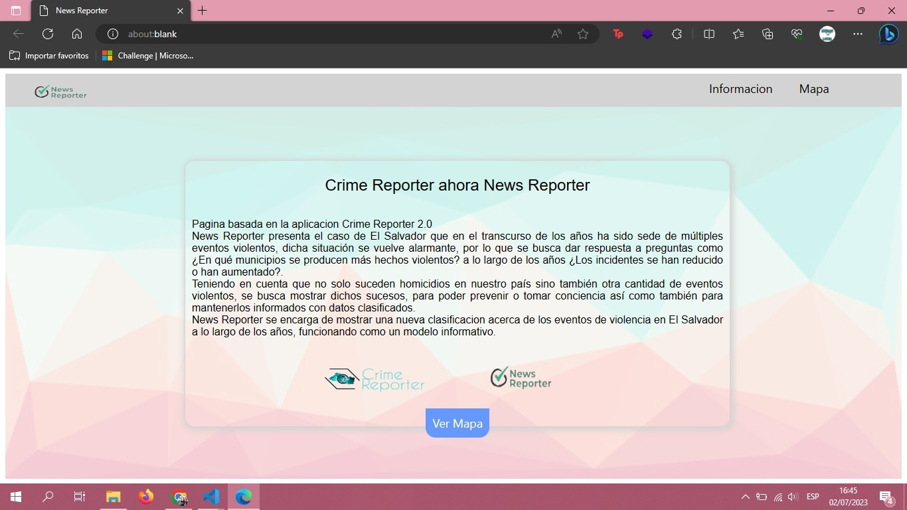
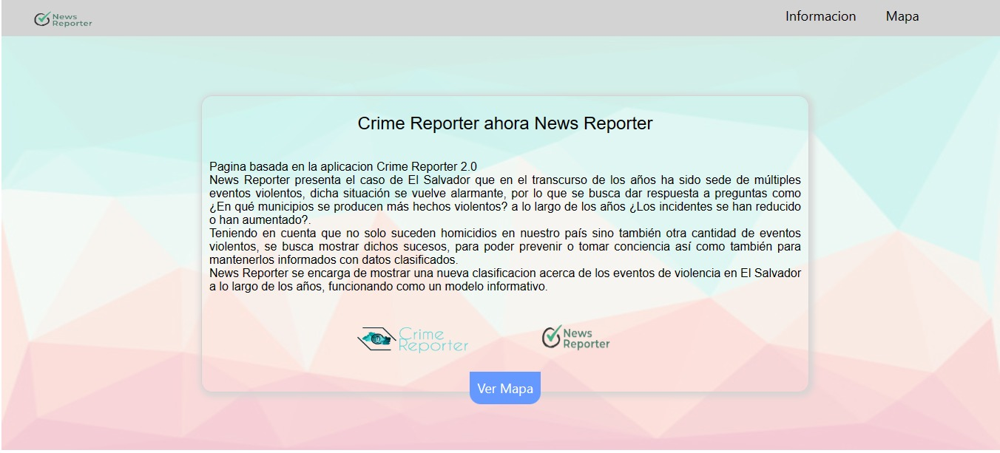
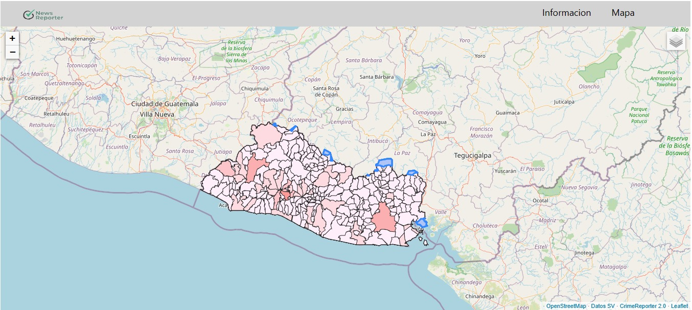
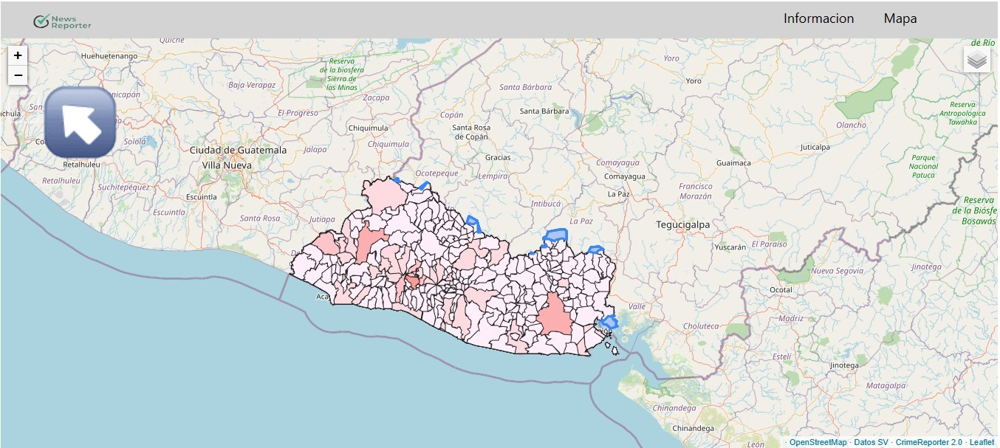
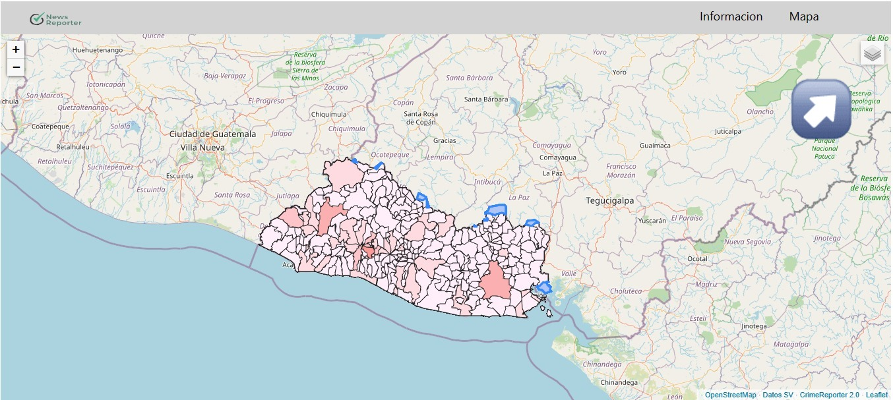
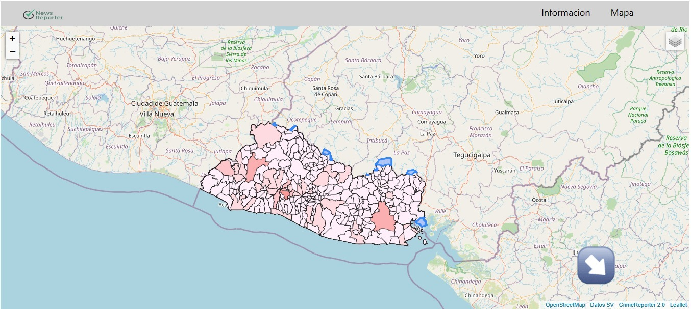

# Bienvenido a la documentación de News Reporter

## Descripción del proyecto
---

News Reporter es una pagina propia basada en el proyecto [Crime Reporter](https://github.com/ReneMel/CrimeReporter-SV), presenta el escenario de El Salvador que en el transcurso de los años ha sido sede de múltiples eventos violentos, dicha situación se vuelve alarmante, por lo que se busca dar respuesta a preguntas como ¿En qué municipios se producen más hechos violentos? a lo largo de los años ¿Los incidentes se han reducido o han aumentado? 
Aparte de ello, se encarga de mostrar una nueva clasificación acerca de los eventos de violencia en El Salvador a lo largo de los años, funcionando como un modelo informativo.

## Licencia
---

GPL v2

Permisos:
 - Uso comercial 
 - Distribución 
 - Modificaciones 
 - Uso de patentes 
 - Uso privado

Condiciones:
 - Revelar fuente 
 - Aviso de licencia y copyright 
 - Misma licencia 
 - Cambios de estado

Limitaciones:
 - Responsabilidad 
 - Garantía

### Modificaciones y nuevas funcionalidades

- Se reclasificó la información para que en vez de mostrar unicamente homicidios, se mostraran distintos hechos de violencia.
- Se cambio la UI/UX ocupando otras tecnologías para mostrar de manera distinta los datos, en escalas de colores
- Se actualizaron los datos, incluyendo el año actual, 2023
- Se realizo la implementación de una nueva fuente de datos

## Licencias y tecnologías utilizadas
---

### [Geoserver](https://geoserver.org/)

Geoserver es un servidor de Java de código abierto que permite a sus usuarios compartir y editar data geoespacial. Es un método fácil para conectar información existente a mapas y globos virtuales.

Licencia: **GPL**

### [Graph API](https://developers.facebook.com/docs/graph-api/)

Graph API de facebook: Es una herramienta para obtener datos dentro y fuera de la plataforma de Facebook. Es una API basada en HTTP que las aplicaciones pueden utilizar para consultar datos mediante programación.

Licencia: **Licencia de uso de la API de Facebook**

### [Leaflet](https://leafletjs.com/)

Es una librería JavaScript open source muy utilizada para la publicación de mapas en la web. Lanzado por primera vez en 2011, es compatible con la mayoría de las plataformas móviles y de escritorio y admite HTML5 y CSS3.

Licencia: **BSD-2-Cláusula**

### [Tweepy](https://www.tweepy.org/)

Es una librería de Python que nos va a permitir realizar lo mismo que en el paso anterior pero de una forma mucho más rápida y eficiente. En general, este tipo de conectores se mantienen por la comunidad.

Licencia: **MIT**

### [QGIS](https://www.qgis.org/en/site/)

Es un Sistema de Información Geográfica (SIG) de software libre y de código abierto para plataformas GNU/Linux, Unix, Mac OS, Microsoft Windows y Android.2​.

Licencia: **GPL-V2.0**

## Manual técnico
---

Esta es una versión web de la aplicación Crime Reporter, por lo que no necesita de ningún instalador ni de algún procedimiento extra para ejecutarlo.

### Crime Reporter

Crime Reporter al ser una aplicacion requiere de los siguientes pasos para su ejecucion.

Requisitos: 
- Tener instalado python 3
- Instalar: pip install virtualenv virtualenv --version

EJECUTAR EN LA CARPETA DEL PROYECTO:

 1. virtualenv venv  
 2. venv\Scripts\activate
 3. pip install -r requirements.txt
 4. Ejecutar con: "flask run" o con "python app.py"
 5. "deactivate" desactiva el env, para correr de nuevo ver la linea 2

## Manual de usuario
---

1. El inicio de la pagina: Se presenta una pantalla en donde el usuario puede conocer acerca de que trata la pagina y presenta el menú con la opción de conocer el mapa y ver la información.

2. En la pestaña del mapa: Al presionar la pestaña del mapa se le presentan los datos en el mapa representados en escalas de colores.

3. Interactividad: Para interactuar con el mapa tenemos varias opciones, como lo es acercar y alejar el mapa.

4. Ademas de ello se tiene la posibilidad de consultar el historial e interactuar con los años

5. También presenta el acceso a las tecnologías y datos utilizados para la realización de dicha página.

